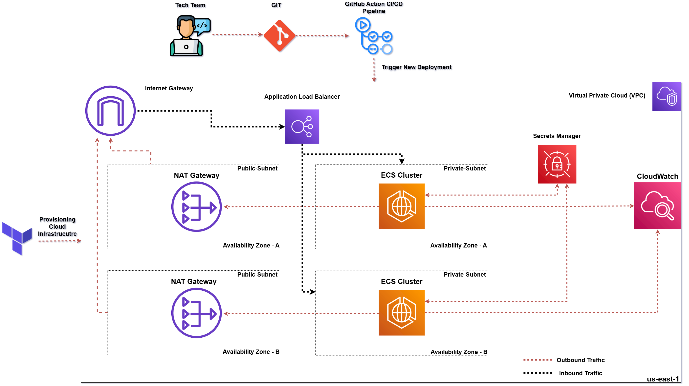

# Node.js Application with CI/CD and Deploy it using Terraform

## 📌 Project Overview

This project demonstrates a basic **Node.js "Hello World" application** containerized with Docker, integrated with a **CI/CD pipeline using GitHub Actions**. The AWS infrastrucutre (ECS Cluster) provisioned using **Terraform**. The application uses GitHub Actions stages to lint, build Dockerfile and push it to GitHub container registry, Deploy by trigger new revision to force task definintion to pull lastest image. The project also  is configured to collect logs from ECS containers via CloudWatch and send them to New Relic For better visibility.

## 🧱 Architecture Design 


## Prerequisites 
**Before you begin, ensure the following tools are installed on your local machine:**
- Docker - for containerization and local debugging
- Terraform - for infrastructure provisioning
- AWS CLI - for managing AWS resources

---

## 📁 Project Structure
- /.github/workflows
  - main.yaml
- /terraform
  - alb.tf
  - iam.tf
  - ecs.tf
  - main.tf
  - outputs.tf
  - variables.tf
  - vpc.tf
- index.js
- .eslintrc.json
- package.json
- package-lock.json
- Dockerfile
- .gitignore
- README.md
---
## 🚀 Deployment Steps
### 1. Create locally terraform.tfvars file under /terraform dir

```bash
region         = "your-aws-region"           # e.g. "us-east-1"
container_port = 3000                        # Port your app listens on
github_repo    = "your-username/repo-name"  # GitHub Container Registry image path
profile        = "your-aws-cli-profile"      # AWS CLI profile name
desired_count  = 1                           # Number of ECS tasks
```    

### 2. Provision AWS Resources using Terraform
Use Terraform to create all necessary AWS infrastructure (VPC, ECS Cluster, IAM roles, ALB):
```bash
terraform init
terraform plan -var-file="terraform.tfvars"
terraform apply -var-file="terraform.tfvars" --auto-approve
``` 
### 3. Push to GitHub to Trigger CI/CD Pipeline
Before triggering the GitHub Actions CI/CD pipeline, ensure the following secrets are added to your GitHub repository:

- AWS_ACCESS_KEY_ID – Your AWS access key ID

- AWS_SECRET_ACCESS_KEY – Your AWS secret access key

- AWS_REGION – The AWS region

- GHCR_USERNAME – Your GitHub username

- GHCR_TOKEN – A GitHub personal access token

#### You can add these secrets by navigating to:
**GitHub Repo → Settings → Secrets and variables → Actions → New repository secret**
### 4. Store GHCR Credentials in AWS Secrets Manager
To allow ECS to pull container images from ghcr registry, store your credentials in AWS Secrets Manager:
- Create a secret named : **github-container-registry-auth**

### 5. Push to GitHub to Trigger CI/CD Pipeline
This will automatically trigger the CI/CD GitHub Actions pipeline, which will:

- Lint the source code.

- Build the Docker image.

- Push the image to GitHub Container Registry.

- Deploy the latest image to AWS ECS  by trigger a new revision for task definintion.

### 6. CloudWatch

AWS CloudWatch is used to monitor and observe the performance of ECS containers and other AWS resources. It collects metrics, logs, and events to provide insights into application behavior.

Additionally, AWS CloudTrail can be integrated to track API activity and retrieve logs related to ECS container operations. This helps in auditing and troubleshooting container deployments and task executions.

To enhance observability, New Relic can be integrated with AWS CloudWatch using a New Relic AWS Lambda function. This Lambda function pulls metrics from CloudWatch and sends them to New Relic using your New Relic license key.